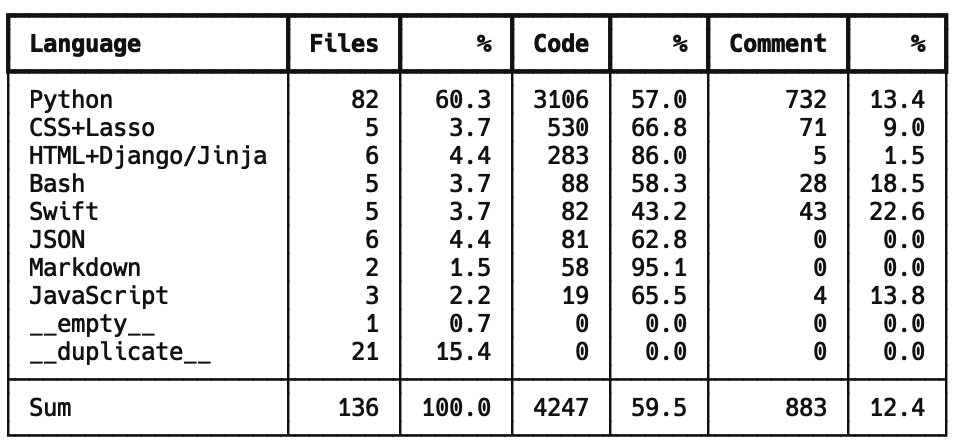

# Agentic Sleep Monitor

> **Development Status**: This project is currently in active development. While the core scientific and research components are functional, the consumer-ready production version is still a work in progress.

## Code Distribution Snapshot

## About this Repository
This repository contains the code for the Agentic Sleep Monitor, a research project focused on advancing accessible and decentralized sleep analysis and monitoring. Code here is not production ready and is subject to change. All code in the `Deprecated` folder were from prior experimentation and are not used in the current implementation. This repository has currently been made public for a submission to the Davison Fellows Scholarship.

## Project Structure

### Core Components
- **Django/**🚧 - Web application framework implementation
  - Contains the main web interface and API endpoints
  - Includes templates and static assets for the user interface
  - Still under active development
- **Training Files/**✅ - Training files for the vision and audio models
- **Report Writer/**✅ - MoA Report Writer code with benchmarks
- **Inference Benchmarking/**✅ - Code for benchmarking the inference speed/efficiency of the models
- **Monitors/**🚧 - Code for the monitors that collect the data from the user end
- **Calculate Stats from Sensors/**🚧 - Code to transform raw sensor data into text-based sleep metrics used by the report writer

Datasets used for training are not included in this repository due to Github file size limits. Please read the technical paper (to be released on the Github) for more information.

### Development Status
- ✅ Backend Structure
- ✅ Basic Data Processing Pipeline
- ✅ Report Writing System
- 🚧 Data Visualization
- 🚧 Sensor Connectivity
- 🚧 User Interface (in development)
- 🚧 Production Deployment Configuration
- 🚧 Consumer-Ready Features

## Technical Stack
- **Backend**: CoreML, Pytorch, and Pytorch Lightning for model inference
- **Frontend**: Django (Python) + HTML/CSS with modern UI components

## Important Notes
1. This project is primarily research-focused at this stage
2. Many features are experimental and subject to change
3. The codebase is actively being refactored and improved
4. The backend structure is ready, but user oriented features are not yet implemented. 

## Future Development
- Finish user interface
- Connect frontend to backend
- Develop iOS app
- Improved data visualization
- Expanded sleep analysis capabilities
- Experimentation with reasoning LLMs like distilled versions of R1
- Production-ready deployment configurations
- Consumer-focused features and documentation

## Contributing
As this project is in active development and we will not be accepting contributions at this time.

## License
Feel free to use the code for your own research and development with proper attribution.

---
*Note: This project is part of ongoing research and development. Features, architecture, and implementation details are subject to change.*

